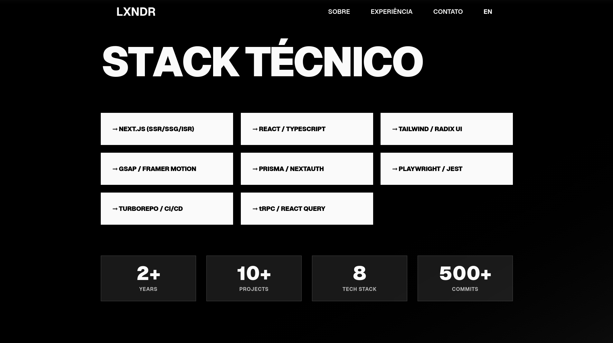
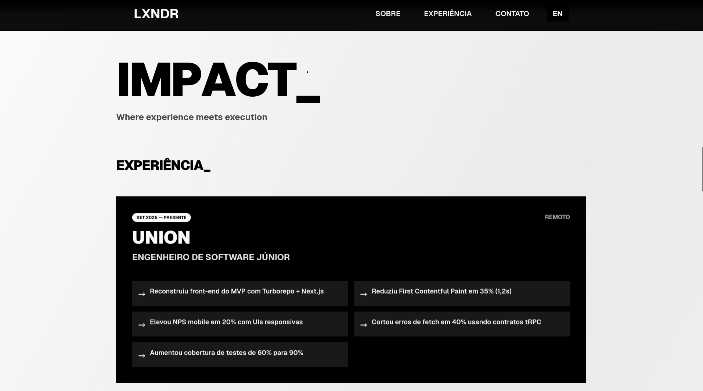

<div align="center">

# SÉRGIO ALEXANDRE

### ⚡ Full Stack Engineer — Building Interfaces That Hit Different

[](https://git.io/typing-svg)

[](https://lxndr-portifolio.vercel.app/)
[](https://linkedin.com/in/serg-alexandre)
[](mailto:sergioalexandre0716@gmail.com)

</div>

---

<div align="center">

📍 **Londrina, Brazil** 🇧🇷 &nbsp;|&nbsp; 🌍 **Open to Remote Worldwide** &nbsp;|&nbsp; ⏰ **GMT-3** *(Flexible hours)*

</div>

---

## ⚡ CURRENT STATUS

```
┌─────────────────────────────────────────────────────────────────┐
│  ROLE        →  Software Engineer @ Union Audio (Audio Tech)   │
│  FOCUS       →  Frontend Architecture • Advanced Animations    │
│  STACK       →  TypeScript • React • Next.js 15+ • GSAP        │
│  EDGE        →  Musician mindset → Emotional UX Design         │
└─────────────────────────────────────────────────────────────────┘
```

**Software Engineer** with **3+ years** of experience building **performant**, **accessible**, and **user-centric** web applications. I combine technical expertise with a musician's attention to detail — crafting interfaces where every animation, interaction, and transition serves the user experience.

---

## 🔥 FEATURED PROJECT: LXNDR PORTFOLIO

> **A brutalist, scroll-driven portfolio showcasing cutting-edge web technologies**

<div align="center">

[](https://lxndr-portifolio.vercel.app/)
[](https://github.com/serg-alexandre/LXNDR-PORTIFOLIO)

</div>

### 📸 Preview

<div align="center">

| Hero Section | Skills Matrix |
|:---:|:---:|
|  |  |

| Impact & Experience |
|:---:|
|  |

</div>

### ✨ Key Features

| Feature | Description |
|---------|-------------|
| 🎨 **Brutalist Design** | High-contrast typography, bold shadows, Evangelion-inspired aesthetic |
| 🔮 **GSAP Animations** | ScrollTrigger, RGB channel split glitch effects, parallax scrolling |
| 🎯 **Magnetic Cursor** | Smooth lerp interpolation with hover scaling on interactive elements |
| 🌧️ **Matrix Rain Effect** | Canvas-based falling code animation using tech stack keywords |
| ✍️ **Text Reveals** | Character-by-character animations with SplitType + 3D rotations |
| 🌍 **Full i18n** | English & Portuguese (Brazil) with next-intl |
| ♿ **Accessibility** | Reduced motion support, keyboard navigation, screen reader compatible |
| 📝 **MDX Blog** | Syntax highlighting with Shiki, reading time, ToC generation |

### 🛠️ Built With


---

## 🎧 FEATURED PROJECT: UNION AUDIO

> **DJ & Producer Feedback Platform — Where I rebuilt the MVP from scratch**

<div align="center">

[](https://mvp-union-audio-frontend.vercel.app/)

</div>

**Union Audio** is an audio tech startup building a community platform where DJs and music producers receive real feedback to level up their craft. As a **Software Engineer**, I led the frontend rebuild using a modern monorepo architecture.

### 📊 Impact Metrics

<div align="center">

| Metric | Result | Details |
|:------:|:------:|:--------|
| ⚡ **FCP** | **-35%** | Reduced First Contentful Paint by 1.2 seconds |
| 📱 **NPS** | **+20%** | Mobile user satisfaction increase with responsive UIs |
| 🔗 **Errors** | **-40%** | Fetch errors eliminated with tRPC type-safe contracts |

</div>

### 🛠️ Tech Stack


### 🎯 Key Contributions

- **Rebuilt MVP frontend** with Turborepo monorepo + Next.js App Router
- **Implemented responsive UIs** that boosted mobile engagement
- **Introduced tRPC contracts** for end-to-end type safety
- **Optimized Core Web Vitals** for faster page loads

---

## 💼 PROFESSIONAL JOURNEY

```
2025 ────────────────────────────────────────────────────────────────
     │
     ├──▶ SOFTWARE ENGINEER @ Union Audio (Sep 2025 - Present)
     │    → Leading frontend architecture & performance optimization
     │
     ├──▶ SOFTWARE ENGINEER INTERN @ Union Audio (Jan 2025 - Sep 2025)  
     │    → Built MVP features, responsive UIs, tRPC integration
     │
2023 ────────────────────────────────────────────────────────────────
     │
     ├──▶ TRAINEE @ Tata Consultancy Services (Feb 2023 - Nov 2023)
     │    → Enterprise software development, agile methodologies
     │
     ├──▶ DEV INTERN @ Tata Consultancy Services (Jun 2022 - Feb 2023)
     │    → Java, Spring Boot, relational databases
     │
2022 ────────────────────────────────────────────────────────────────
```

**Education:** Systems Analysis & Development @ UTFPR *(Graduating Jul 2026)*

---

## 🛠️ TECH STACK

<div align="center">

### Languages & Core


### Frontend


### Backend & Database


### Tools & DevOps


</div>

---

## 📊 GITHUB STATS

<div align="center">


</div>

<div align="center">

[](https://git.io/streak-stats)

</div>

---

## 🎹 BEYOND CODE

<div align="center">

### Music Producer — **LXNDR**

*Creating instrumental tracks blending minimalism, classical, and experimental techno*

[](https://soundcloud.com/lxndr_serg)

</div>

> *"As a musician, I approach UX design like composing music — every animation has rhythm, every transition has purpose, and the user's emotional journey is the melody that ties it all together."*

This artistic background gives me a unique edge in:
- **Animation timing** — Knowing when to pause, accelerate, or ease
- **Emotional UX** — Creating interfaces that *feel* right, not just look right
- **Attention to detail** — Obsessing over the micro-interactions that matter

---

## 📫 LET'S CONNECT

<div align="center">

### 💼 Open to Opportunities

**Looking for:** Remote Positions • Contract Work • Interesting Projects  
**Availability:** Immediate • Flexible hours for international teams

[](https://linkedin.com/in/serg-alexandre)
[](mailto:sergioalexandre0716@gmail.com)
[](https://lxndr-portifolio.vercel.app/)

---

**Response Time:** Usually within 24 hours  
**Languages:** 🇧🇷 Portuguese *(Native)* &nbsp;|&nbsp; 🇬🇧 English *(Fluent — C2 EF SET 72/100)*

</div>

---

<div align="center">

```
╔═══════════════════════════════════════════════════════════════════╗
║                                                                   ║
║   "Turning ideas into digital experiences with attention to      ║
║    every pixel, every animation, every user emotion."            ║
║                                                                   ║
╚═══════════════════════════════════════════════════════════════════╝
```

<sub>Built with TypeScript, Next.js, and a musician's obsession for detail</sub>

</div>
